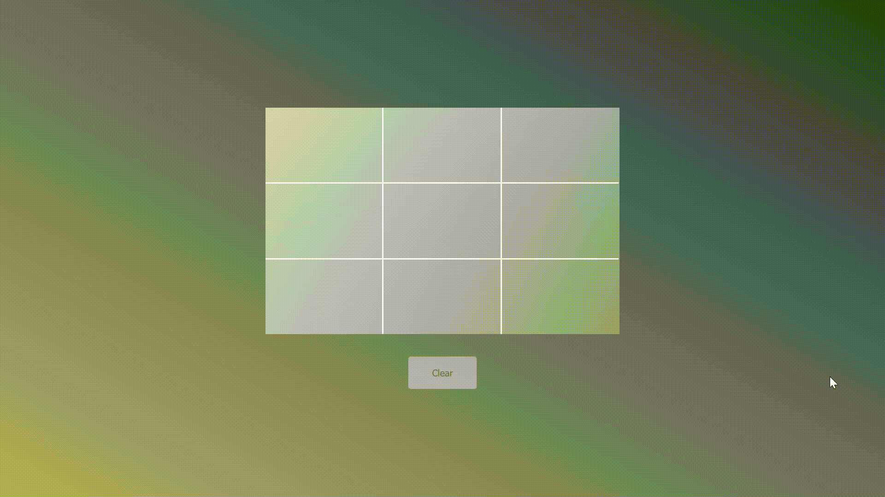

# Tic Tac Toe: A Beginners Project

This project was bootstrapped with [Create React App](https://github.com/facebook/create-react-app).

This is a fairly simple react app specially for the beginners. Here we are using a single functional component with the `useState` react hook & the rest of focuses on the business login, HTML & CSS code snippets.

## Live Web App

This app is being served live on [tic-tac-toe-techiabhil](https://tic-tac-toe-techiabhil.herokuapp.com/) URL.

## Available Scripts

In the project directory, you can run:

### `npm start`

Runs the app in the development mode.\
Open [http://localhost:3000](http://localhost:3000) to view it in the browser.

The page will reload if you make edits.
You will also see any lint errors in the console.

## Deployment

This app is hosted on `Heroku`, with the automatic deployment configuration. Whenever there is a push/merge to `master` branch the deployment jobs will get triggered and we will always be served with the latest code base, of course...! unless there is an error😉.

## External Dependecies

This app only has one external dependency i.e [Sweetalert2](https://www.npmjs.com/package/sweetalert2).
This package is used to prompt user with a nice message.
